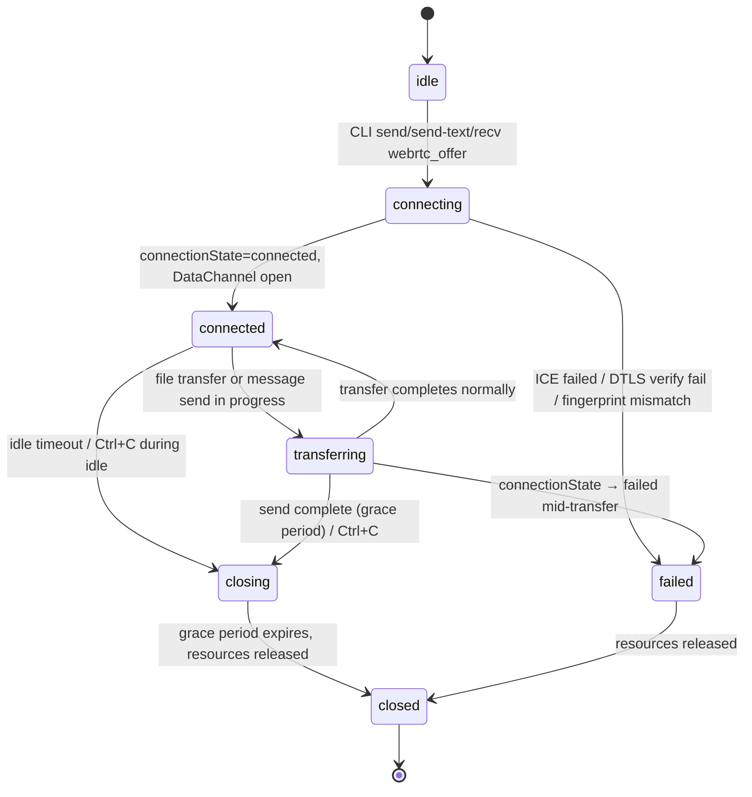

# Fact: M3 PeerConnection Lifecycle

M3 PeerConnection 生命周期事实表。来源：M3 startup sediment Brief #A。

## States

| State          | Meaning                                                                                |
| -------------- | -------------------------------------------------------------------------------------- |
| `idle`         | 未建立任何 PeerConnection。初始状态。                                                  |
| `connecting`   | 已 `createOffer` / `setRemoteDescription`，等待 ICE negotiation 和 DataChannel 打开。  |
| `connected`    | `connectionState` = `connected`，DataChannel(s) 已 `open`。可以收发应用消息。          |
| `transferring` | 文件传输或消息发送中（连接活跃使用）。控制面仍可通过 control channel 发送消息。        |
| `closing`      | 正在主动关闭（grace period）。不再接受新应用消息，但继续处理 inflight 确认。           |
| `closed`       | 完全关闭，资源释放。PeerConnection 和 DataChannel 均已 close。                         |
| `failed`       | 连接失败（ICE failed / DTLS verify fail / fingerprint mismatch）。不可恢复的终端状态。 |

## Transitions

### idle → connecting

**触发条件**：

- CLI `send <peer> <file>` 或 `send-text <peer> <text>` 调用（主动方：创建 PeerConnection，生成 SDP offer，通过 `signal` 发送）
- CLI `recv` 收到 `signal_in{subtype: "webrtc_offer"}`（被动方：创建 PeerConnection，`setRemoteDescription(offer)`，生成 answer）

**进入动作**：创建 `node-datachannel.PeerConnection`，注册 `onLocalDescription` / `onLocalCandidate` 信令回调。

### connecting → connected

**触发条件**：`connectionState` 变为 `connected`，且 control channel 的 `open` 事件已触发。

**进入动作**：发送 `room:hello`（发起方立即发送；接收方收到第一条消息后回复）。

### connecting → failed

**触发条件**（任一）：

- ICE negotiation 超时（60s 内未到达 `connected`）
- DTLS certificate fingerprint 与 SDP 声明不匹配（WebRTC 层自动触发 `failed`）
- Ed25519 signature verify 失败（应用层在 `setRemoteDescription` 前拒绝，close PC）
- peer_id 不在 `known_peers.toml` 中
- SDP answer 超时（发起方 30s 内未收到 `signal_in{webrtc_answer}`）

**进入动作**：关闭 PeerConnection，CLI 退出码 1。

### connected → transferring

**触发条件**：`room:file_offer` 被接受且开始发送/接收 chunk，或发送方开始 `room:msg` 传输。

**进入动作**：开始文件 chunk 序列或消息发送。

### transferring → connected

**触发条件**：文件传输完成（收到 `room:file_done`）或消息发送完成，且无后续传输排队。

**进入动作**：Control channel 恢复纯空闲状态。

### connected / transferring → closing

**触发条件**（任一）：

- `send`/`send-text` 完成传输 → 进入 send grace period
- 用户 Ctrl+C → abort 当前传输 → 进入 close 流程
- Idle timeout: control channel 上最后一条消息后 300s 无活动 → 发送 `room:ping` → 10s 内未收到 `room:pong` → close

**进入动作**：停止接受新应用消息，启动 grace timer。

### transferring → failed

**触发条件**：`connectionState` 变为 `failed`（网络断开、对端崩溃等）。

**进入动作**：abort 当前传输，删除 `.part` 文件，CLI 退出码 1。

### connected → failed (M3 Phase 8 新增触发路径)

**触发条件在控制 channel `connected` 后、应用层握手期间**：

- `room:hello` SemVer major 不匹配 → `PeerSession.fail('hello_version_mismatch')`。实现于 `packages/p2p/src/room-session.ts:165` (`autoHello: true` 路径)。遵循 [datachannel-error-protocol](../decisions/datachannel-error-protocol.md) scenario #5：关闭控制 DataChannel、不发其他应用消息、不回复包含 error 字段的 hello（`RoomHello` schema 未预留 error 字段）。
- 5s 内未收到对端 `room:hello` → `PeerSession.fail('hello_timeout')`。阈值可配为 `RoomSessionOptions.helloTimeoutMs`。

两者均是 `connected` 状态下由 `RoomSession` 主动调用 `PeerSession.fail()` 触发的，走进与 ICE/DTLS 失败同一条 `failed` 状态进入路径。`PeerSessionErrorReason` 类型在 `packages/p2p/src/errors.ts` 包含 `hello_version_mismatch` / `hello_timeout` 两个枚举值。

### closing → closed

**触发条件**：grace period 到期。

**进入动作**：关闭 DataChannel（如仍 open），关闭 PeerConnection，释放 `node-datachannel` 资源。

### failed → closed

**触发条件**：自动瞬态转换（failed 状态后立即释放资源）。

**进入动作**：同 closing → closed。

## Establish triggers

> 引用：blind §2.7(a)

| 角色       | 触发事件                                             | 动作                                                                                                                                                         |
| ---------- | ---------------------------------------------------- | ------------------------------------------------------------------------------------------------------------------------------------------------------------ |
| **主动方** | CLI `send` / `send-text` 调用                        | 创建 PeerConnection → 生成 SDP offer → 通过 `signal{subtype: "webrtc_offer"}` 发送 → 等待 answer                                                             |
| **被动方** | CLI `recv` 收到 `signal_in{subtype: "webrtc_offer"}` | 创建 PeerConnection → `setRemoteDescription(offer)` → 验证 Ed25519 签名 → 生成 answer → 通过 `signal{subtype: "webrtc_answer"}` 回发 → 等待 DataChannel open |

`recv` 模式下，每次 webrtc_offer 建立一条新的 PeerConnection。多条并发连接由 `packages/p2p` 的 `PeerConnectionManager` 内部管理（每个 peer_id 最多一条活跃连接）。

## Close triggers

> 引用：blind §2.7(b) + sediment plan §B.1

| 场景                                        | 行为                                                                               | Grace period                              |
| ------------------------------------------- | ---------------------------------------------------------------------------------- | ----------------------------------------- |
| `send`/`send-text` 完成传输                 | 进入 closing → 等待 grace → close                                                  | 5s (send) / 2s (recv, 对端视角)           |
| Ctrl+C (SIGINT)                             | abort 当前传输（如存在）→ 进入 closing → close                                     | 0 (不清除；直接进入 close 流程并释放资源) |
| Idle timeout                                | control channel 无活动 300s → 发送 `room:ping` → 等待 10s → 无 `room:pong` → close | 0 (ping/pong 已给 10s 窗口)               |
| PeerConnection `connectionState` → `failed` | 立即 close，不重连                                                                 | 0                                         |
| CLI 进程 exit (正常)                        | 按当前状态走对应 close 路径                                                        | per state rules                           |

## Idle timeout 参数

| 参数                   | 默认值                 | 单位 | 说明                                                          |
| ---------------------- | ---------------------- | ---- | ------------------------------------------------------------- |
| `idle_timeout_ms`      | 300000                 | ms   | control channel 上最后一条消息后，等待多少 ms 才开始发送 ping |
| `ping_interval_ms`     | (同 `idle_timeout_ms`) | ms   | idle timeout 触发后才发一次 ping；无需周期性 ping interval    |
| `pong_timeout_ms`      | 10000                  | ms   | 发送 `room:ping` 后，多少 ms 内未收到 `room:pong` 则关闭      |
| `send_grace_period_ms` | 5000                   | ms   | send 完成后等待对端确认的宽限期                               |
| `recv_grace_period_ms` | 2000                   | ms   | 接收方处理完成后等待 flush 的宽限期                           |

全部参数从 `P2PConfig` 可覆盖。`P2PConfig` 在 M3 实施时定义于 `packages/p2p`。

**注意**：`ping_interval_ms` 不是周期性 ping 的间隔。M3 采用的策略是 **lazy ping** — 仅在 idle timeout 触发后才发一次 ping 探测对端是否存活。如果连接一直在传输文件（transferring 状态），不会发送 ping。

## Reconnection policy

**不重连。** PeerConnection 进入 `failed` 或 `closed` 后，必须由 caller 重新发起新的 PeerConnection。

**理由**：

- 文件 resume 不在 M3 范围（参见 [webrtc-datachannel-limits.md](webrtc-datachannel-limits.md)「续传：第一版不做。失败重传整个文件」）
- M3 的 PeerConnection 是每次 `send`/`send-text` 重建的临时连接，重连逻辑属于连接池管理 → 移至 M4 daemon 层实现
- WebRTC ICE restart 的复杂度（SDP 重协商、candidate 重收集、状态恢复）超出 M3 的临时连接模型

**Cross-slice**: 重连策略在 M4 daemon 层实现，见 BACKLOG U-13。

## Boundaries

- **不覆盖**: DataChannel-level 状态机（control channel open/close/bufferedAmount、bulk channel 创建失败退化）— 见 Brief #B 协商。
- **不覆盖**: ICE candidate gathering / restart — 属 WebRTC 内部协议 + M4 daemon 持久连接。
- **不覆盖**: 文件传输 chunk-level 状态（chunk 序号、SHA-256 增量校验、进度上报频率 N）— M3 实施 brief 处理。
- **不覆盖**: `room:hello` capabilities 谈判后什么 feature 可用（如 `bulk_transfer` 谈判后被关闭时应该 fall back 到 control channel 还是拒绝 transfer）——是 Phase 9 CLI 层选择，未 sediment。major mismatch / hello timeout 的 PC 生命周期已在 §connected→failed 覆盖；hello 应用层语义见 [datachannel-error-protocol](../decisions/datachannel-error-protocol.md) scenarios #5/#6。

## Reference

- Implementation: `packages/p2p`（M3 实施 brief）
- Caller side: [m3-cli-p2p-bypass-daemon.md](../decisions/m3-cli-p2p-bypass-daemon.md) — CLI bypass 架构决定
- Sibling FSM: [signaling-client-fsm.md](signaling-client-fsm.md) — rendezvous WebSocket 层的状态机
- DataChannel limits: [webrtc-datachannel-limits.md](webrtc-datachannel-limits.md) — SCTP 约束、node-datachannel 限制、三平台预编译
- Probe verification: `packages/p2p-probe/src/probe.ts`（commit 7f2e7ac）— node-datachannel API surface confirmation
